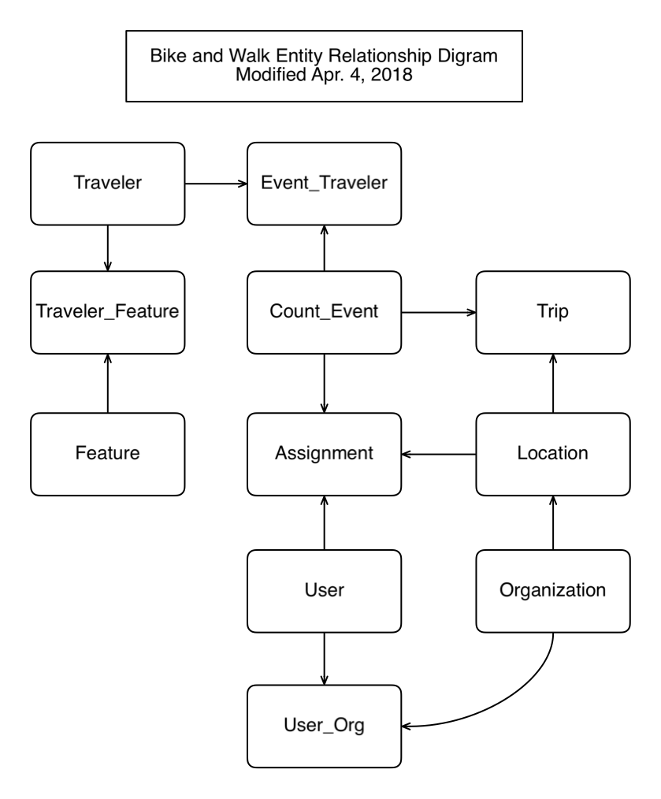

#Data Dictionary

##Entity Relationship Diagram

##Table Definitions

_Updated Jan 16, 2016_

Primary keys have been omitted for simplicity here. A numeric key field named "ID" included in each table.

<table class="dataTable" >
	<tr>
		<th colspan="2">organization</th>
	</tr>
	<tr>
		<td class="tableDesc" colspan="2">As I anticipate the database being used as a central repository to be used by various organizations, it would be useful to have a way to view counts, settings and data that are created by a given organization</td>
	</tr>
	<tr>
		<td class="fieldName">name</td>
		<td class="fieldDesc">The name of the Organization</td>
	</tr>
	<tr>
		<td class="fieldName">email</td>
		<td class="fieldDesc">contact email for the org. administrator</td>
	</tr>
	<tr>
		<td class="fieldName">defaultTimeZone</td>
		<td class="fieldDesc">The time zone to be used by default when creating countEvent records for this organization. A 3 char string such as "PST", "EST", etc.</td>
	</tr>
</table>

<table class="dataTable" >
	<tr>
		<th colspan="2">user</th>
	</tr>
	<tr>
		<td class="tableDesc" colspan="2">This table contains details about the people who do the counting</td>
	</tr>
	<tr>
		<td class="fieldName">name</td>
		<td class="fieldDesc"></td>
	</tr>
	<tr>
		<td class="fieldName">email</td>
		<td class="fieldDesc"></td>
	</tr>
	<tr>
		<td class="fieldName">userName</td>
		<td class="fieldDesc">it is a user table after all...</td>
	</tr>
	<tr>
		<td class="fieldName">password</td>
		<td class="fieldDesc"></td>
	</tr>

	<tr>
		<td class="fieldName">role</td>
		<td class="fieldDesc">Used to determine the level of access this user has to the database. Defaults to "counter" but could be administrator</td>
	</tr>
	<tr>
		<td class="fieldName">inactive</td>
		<td class="fieldDesc">We don't want to delete a record after someone has participated in a count so we can set it to inactive to hide it during data input as a convenience to the administrator. Defaults to false. </td>
	</tr>
	<tr>
		<td class="fieldName">organization_ID</td>
		<td class="fieldDesc">Foreign key link to organization. Each record can only be associated with one organization.</td>
	</tr>
</table>

<table class="dataTable" >
	<tr>
		<th colspan="2">location</th>
	</tr>
	<tr>
		<td class="tableDesc" colspan="2">Represents a physical location where a count is to take place</td>
	</tr>
	<tr>
		<td class="fieldName">locationName</td>
		<td class="fieldDesc">A descriptive name for reference</td>
	</tr>
	<tr>
		<td class="fieldName">NS_Street</td>
		<td class="fieldDesc">The street that runs north and south at this location</td>
	</tr>
	<tr>
		<td class="fieldName">EW_Street</td>
		<td class="fieldDesc">The street that runs east and west at this location</td>
	</tr>
	<tr>
		<td class="fieldName">locationType</td>
		<td class="fieldDesc">Is this counting location at an "intersection" or is it "screenline" (mid-block)?</td>
	</tr>
	<tr>
		<td class="fieldName">city</td>
		<td class="fieldDesc"></td>
	</tr>
	<tr>
		<td class="fieldName">state</td>
		<td class="fieldDesc"></td>
	</tr>
	<tr>
		<td class="fieldName">latitude</td>
		<td class="fieldDesc">For mapping</td>
	</tr>
	<tr>
		<td class="fieldName">longitude</td>
		<td class="fieldDesc">For mapping</td>
	</tr>
	<tr>
		<td class="fieldName">organization_ID</td>
		<td class="fieldDesc">Foreign key link to Organization</td>
	</tr>
</table>

<table class="dataTable" >
	<tr>
		<th colspan="2">countEvent</th>
	</tr>
	<tr>
		<td class="tableDesc" colspan="2">This table represents traffic count being conducted by one Organization on a particular date and time. The count will be conducted at one or more locations.</td>
	</tr>
	<tr>
		<td class="fieldName">title</td>
		<td class="fieldDesc">A descriptive title for this event.</td>
	</tr>
	<tr>
		<td class="fieldName">startDate</td>
		<td class="fieldDesc">The starting date and time</td>
	</tr>
	<tr>
		<td class="fieldName">endDate</td>
		<td class="fieldDesc">The ending date and time</td>
	</tr>
	<tr>
		<td class="fieldName">timeZone</td>
		<td class="fieldDesc">The time zone where the counting will take place. In the format "PST", "EST", etc.</td>
	</tr>
	<tr>
		<td class="fieldName">isDST</td>
		<td class="fieldDesc">0 if event is not during daylight savings time, else 1</td>
	</tr>
	<tr>
		<td class="fieldName">weather</td>
		<td class="fieldDesc">A numerical code that describes the weather conditions at the time of the count. A non-null value here will also act as an indicator that the count is complete for this location. </td>
	</tr>
	<tr>
		<td class="fieldName">organization_ID</td>
		<td class="fieldDesc">Foreign key link to Organization</td>
	</tr>
</table>
<table class="dataTable" >
	<tr>
		<th colspan="2">assignment</th>
	</tr>
	<tr>
		<td class="tableDesc" colspan="2">(formerly named "countingLocation") This table represents a single location where the count is being done as part of the related count event. </td>
	</tr>
	<tr>
		<td class="fieldName">assignmentUID</td>
		<td class="fieldDesc">A unique identifier string that will be used to load the Count Location data into the client app. The goal is to create a hard to guess string to make it unlikely that someone other than the assigned person could guess the uri and be able to intentionally or accidentally enter bad data into the database.  </td>
	</tr>
	<tr>
		<td class="fieldName">countEvent_ID</td>
		<td class="fieldDesc">Foreign key link to the Count Event record</td>
	</tr>
	<tr>
		<td class="fieldName">location_ID</td>
		<td class="fieldDesc">Foreign key link to the location record.</td>
	</tr>
	<tr>
		<td class="fieldName">user_ID</td>
		<td class="fieldDesc">Foreign key link to the person assigned to count at this location</td>
	</tr>

</table>

<table class="dataTable" >
	<tr>
		<th colspan="2">trip</th>
	</tr>
	<tr>
		<td class="tableDesc" colspan="2">This table represents the count data.</td>
	</tr>
	<tr>
		<td class="fieldName">tripCount</td>
		<td class="fieldDesc">The number of travelers</td>
	</tr>
	<tr>
		<td class="fieldName">tripDate</td>
		<td class="fieldDesc">Date and time of trip.</td>
	</tr>
	<tr>
		<td class="fieldName">seqNo</td>
		<td class="fieldDesc">A sequence number used in conjunction with the assignment record ID. It represents a trip by one or more travelers and is used to undo trips that the user
			has entered in error.</td>
	</tr>
	<tr>
		<td class="fieldName">turnDirection</td>
		<td class="fieldDesc">A code that indicates the direction of travel upon entering the intersection and whether the traveler went straight through or turned, and if so, in what direction. Using the Bicycle and Pedestrian Documentation Project coding of A1, B2, etc. as used on their count sheet.</td>
	</tr>
	<tr>
		<td class="fieldName">location_ID</td>
		<td class="fieldDesc">Foreign key link to Count Location record</td>
	</tr>
	<tr>
		<td class="fieldName">traveler_ID</td>
		<td class="fieldDesc">Foreign key link to the Traveler record</td>
	</tr>
</table>

<table class="dataTable" >
	<tr>
		<th colspan="2">provisionalTrip</th>
	</tr>
	<tr>
		<td class="tableDesc" colspan="2">
			
There may be a situation where the server receives a new trip record request which could not be validated for
			some reason. Rather that reject the record, the system will record the trip here with some description of
			the issue. 

			
An administrator will need to manually review the record for correction and transfer to the trip table.

			

				This table is identical to the trip table with the addition of the field below.
			

		</td>
	</tr>
	<tr>
		<td class="tableDesc" colspan="2">... includes all fields form Trip table plus ...</td>
	</tr>
	<tr>
		<td class="fieldName">issue</td>
		<td class="fieldDesc">A message about the reason(s) the trip record didn't validate</td>
	</tr>
</table>

<table class="dataTable" >
	<tr>
		<th colspan="2">eventTraveler</th>
	</tr>
	<tr>
		<td class="tableDesc" colspan="2">An associative table to indicate which Traveler types are to be counted during an Count Event. </td>
	</tr>
	<tr>
		<td class="fieldName">sortOrder</td>
		<td class="fieldDesc">used to control the order in which Traveler icons are displayed in the client app. </td>
	</tr>
	<tr>
		<td class="fieldName">countEvent_ID</td>
		<td class="fieldDesc">Foreign key link to the Count Event record</td>
	</tr>
	<tr>
		<td class="fieldName">traveler_ID</td>
		<td class="fieldDesc">Foreign key link to the Traveler record. </td>
	</tr>
</table>

<table class="dataTable" >
	<tr>
		<th colspan="2">traveler</th>
	</tr>
	<tr>
		<td class="tableDesc" colspan="2">Represents the Traveler types that may be counted.</td>
	</tr>
	<tr>
		<td class="fieldName">name</td>
		<td class="fieldDesc">A name for reference. </td>
	</tr>
	<tr>
		<td class="fieldName">description</td>
		<td class="fieldDesc">A description of the intended purpose of this Traveler and it's associated Features</td>
	</tr>
	<tr>
		<td class="fieldName">iconURL</td>
		<td class="fieldDesc">Unambiguous internet location where an icon for this Traveler type can be found. </td>
	</tr>
	<tr>
		<td class="fieldName">travelerCode</td>
		<td class="fieldDesc">a unique text code assigned to this traveler. Use as a short cut to select for this traveler when reporting etc. </td>
	</tr>
</table>

<table class="dataTable" >
	<tr>
		<th colspan="2">travelerFeature</th>
	</tr>
	<tr>
		<td class="tableDesc" colspan="2">An associative table that links a Traveler record to one or more Feature records. </td>
	</tr>
	<tr>
		<td class="fieldName">traveler_ID</td>
		<td class="fieldDesc">Foreign key link to the Traveler record. </td>
	</tr>
	<tr>
		<td class="fieldName">feature_ID</td>
		<td class="fieldDesc">Foreign key link to the Feature record. </td>
	</tr>
</table>

<table class="dataTable" >
	<tr>
		<th colspan="2">feature</th>
	</tr>
	<tr>
		<td class="tableDesc" colspan="2">
A feature may describe a wide range of details about a traveler that has been counted. The possible list may include:

		</td>
	</tr>
	<tr>
		<td class="fieldName">featureClass</td>
		<td class="fieldDesc">
			

				A category that tends to classify the feature being described. Initially the classes may include:
				<ul>
					<li>Mode (Bike, Walk, etc)</li>
					<li>Gender</li>
					<li>Behavior (Sidewalk Riding, Helmet use, etc.)</li>
					<li>Age Group</li>
				</ul> 
			

		</td>
	</tr>
	<tr>
		<td class="fieldName">featureValue</td>
		<td class="fieldDesc">A value for the featureClass</td>
	</tr>
</table>

<table class="dataTable" >
	<tr>
		<th colspan="2">outbox</th>
	</tr>
	<tr>
		<td class="tableDesc" colspan="2">
			A temporary storage table for email messages awaiting processing. After a message has been successfully
			sent, the outbox record is deleted.
			After some number of failed attempts, the admin is informed of the failure and the outbox record is deleted.
		</td>
	</tr>
	<tr>
		<td class="fieldName">from</td>
		<td class="fieldDesc">
			From address to use for email. Usually the admin email address form the 
			organization for which the email is being sent
		</td>
	</tr>
	<tr>
		<td class="fieldName">to</td>
		<td class="fieldDesc">Recipient email address or comma separated addresses.</td>
	</tr>
	<tr>
		<td class="fieldName">replyTo</td>
		<td class="fieldDesc">Reply-to email address if diff from "from".</td>
	</tr>
	<tr>
		<td class="fieldName">CC</td>
		<td class="fieldDesc">Carbon Copy recipient email address or comma separated addresses.</td>
	</tr>
	<tr>
		<td class="fieldName">BCC</td>
		<td class="fieldDesc">BCC recipient email address or comma separated addresses.</td>
	</tr>
	<tr>
		<td class="fieldName">subject</td>
		<td class="fieldDesc">Subject text</td>
	</tr>
	<tr>
		<td class="fieldName">messageText</td>
		<td class="fieldDesc">
			The text version of the email message.
		</td>
	</tr>
	<tr>
		<td class="fieldName">messageHTML</td>
		<td class="fieldDesc">
			The HTML version of the email message if any.
		</td>
	</tr>
	<tr>
		<td class="fieldName">sendAttemptCount</td>
		<td class="fieldDesc">
			The number of times the system attempted and failed to send the message. After some number of failed attempts
			the sys admin will be notified and the outbox record will be deleted.
		</td>
	</tr>
	<tr>
		<td class="fieldName">lastSendTime</td>
		<td class="fieldDesc">
			The DateTime of the last send attempt so we don't attempt to resend failed messages too fast.
		</td>
	</tr>
	<tr>
		<td class="fieldName">dateSent</td>
		<td class="fieldDesc">
			The DateTime when the message was successfully sent. This is useful if the message is sent, but the record could
			not be deleted for some reason so that we don't keep sending the message forever.
		</td>
	</tr>
	<tr>
		<td class="fieldName">sendHistory</td>
		<td class="fieldDesc">
			Success or error responses from mail server.
		</td>
	</tr>
</table>