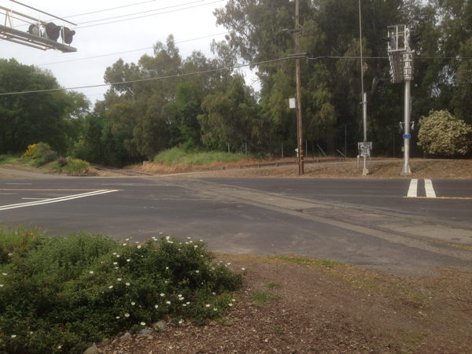
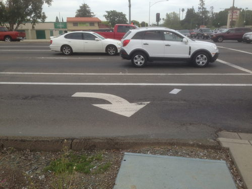
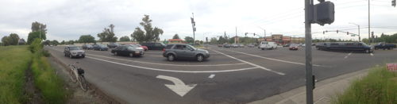
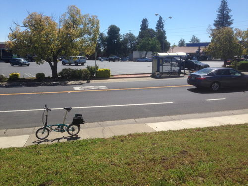
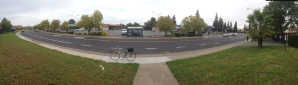
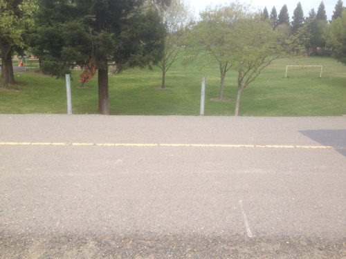

<h2>Del Rio Trail Bike Count Project</h2>

The Del Rio Bike Count is organized to provide data for the planning phase of a proposed Bike and Pedestrian trail
that will run from the Sacramento Bike Trail, south of Miller Park, over I-5 via the unused rail bridge and ultimately 
following the old rail right of way to just north of the town of Freeport.

#### Screenline Counts ####

This count is different from other counts we've done because all but one of the locations will be counted using the "Screenline" 
technique instead of the intersection counts we have done in the past.

In a Screenline count, you position yourself to either side of the road or path, and count the bicyclists or pedestrians that 
cross the imaginary line in front of you. When using the on-line counting tool, pay special attention to the directional
indicators ("Northbound" / "SouthBound" or "Eastbound" / "Westbound") to be sure that you are recording the correct direction
of travel. 

Use the **"Change Directions"** button to swap the labels as needed to make counting more convenient to you. 

#### We will be counting at the six locations listed below: ####

______________

## 1. Miller Park Trail Entrance ##

 

The Miller Park location is on the bike trail just south of the boat launch parking lot. This is a "Screenline" count location. 
Position yourself on the river side of the bike trail facing the freeway. There is a widish area with a tree where you won't be in 
danger of being run over by crazy bicycles.

	

	

&nbsp;

______________

## 2. South Land Park @ Del Rio Trail ##

 

The South Land Park Dr. location is the only "intersection" style location. However it's not the
usual intersection between 2 streets. Instead this is the intersection of South Land Park Dr. and the
railroad tracks that mark the proposed Del Rio Trail. There may be some foot and bike traffic along the
tracks.

	

&nbsp;

______________

## 3. Freeport Blvd. at Fruitidge ##

 

For the Freeport Bl. location near Fruitridge, position yourself north of Fruitridge facing west from in front of the 
Centennial Methodist Church. You'll be able to stand safely out of the way at the edge of the parking lot there.

	

&nbsp;

______________

## 4. Freeport Blvd. at Florin ##

 

This is a very busy location as far as car traffic is concerned, but there is a green metal utility cover on the north west corner
of Freeport that gives a safe place to stand away from traffic.

This is another Screenline location.

	

	

&nbsp;

______________

## 5. South Land Park at Florin ##

 

South Land Park just north of Florin Rd. is a Screenline location. A good spot to count
 is facing east towards the shopping center.

	

	

&nbsp;

______________

## 6. Garcia Bend Park ##

 

The Garcia Bend Park location is on the bike trail overlooking the park. This is another "Screenline" count location where
we will be counting riders and walkers who pass across an imaginary line on the trail. Position yourself on the river side of the
trail facing East toward the park.

	

&nbsp;

